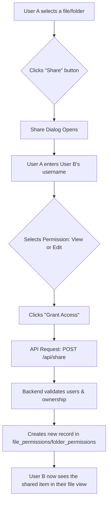

# Plan: Implement File & Folder Sharing

This feature will allow a user to grant read-only or read/write access to their files and folders to other registered Stashcord users.

## Workflow

## Task Breakdown

-   [ ] **Backend:** Create new API endpoints for sharing.
-   [ ] **Backend:** Update existing endpoints to respect permissions.
-   [ ] **Frontend:** Design and build the "Share" dialog component.
-   [ ] **Frontend:** Integrate the "Share" dialog into file/folder menus.
-   [ ] **Frontend:** Modify the main file view to display shared items.
-   [ ] **Backend:** Implement logic to notify users of new shares.