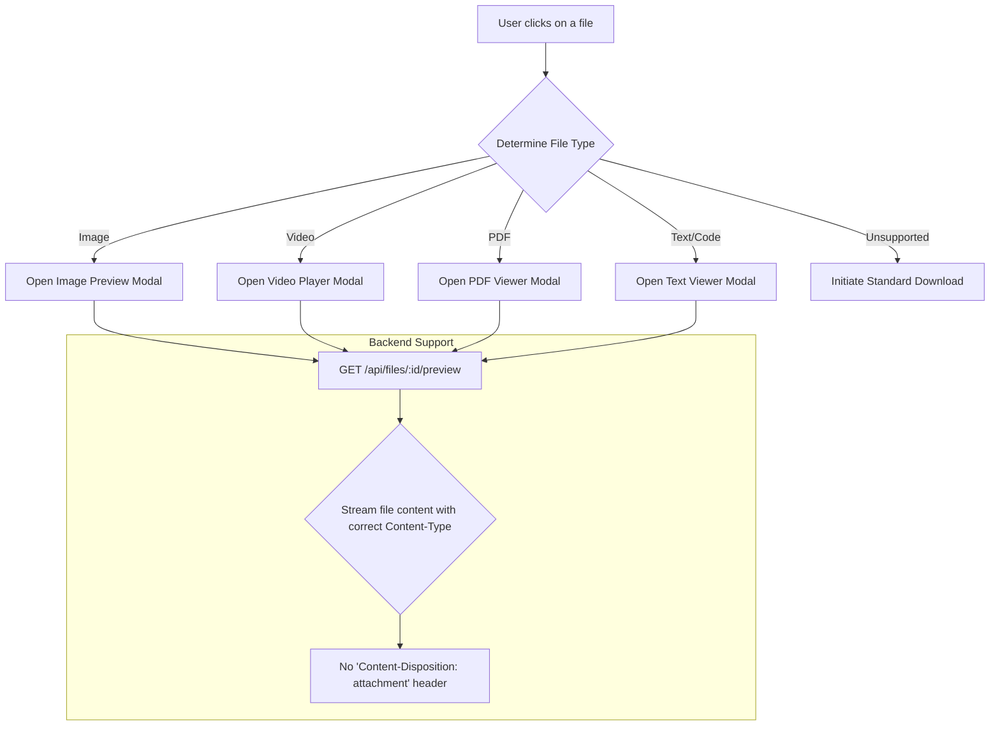

# Plan: In-App File Previews

This feature will allow users to preview common file types (images, videos, PDFs, plain text) directly within the Stashcord UI instead of forcing a download.

## Workflow

## Proposed Task Breakdown

-   [ ] **Backend:** Create a new API endpoint (`/api/files/:id/preview`) that streams file content with the appropriate `Content-Type` header for in-browser viewing.
-   [ ] **Frontend:** Develop a universal "Preview" modal component.
-   [ ] **Frontend:** Implement specific preview handlers within the modal for different file types (e.g., an `` tag for images, a `<video>` player for videos).
-   [ ] **Frontend:** Integrate a PDF rendering library (like `react-pdf`) for PDF previews.
-   [ ] **Frontend:** Update the `FileCard` component's click action to open the preview modal instead of downloading directly.