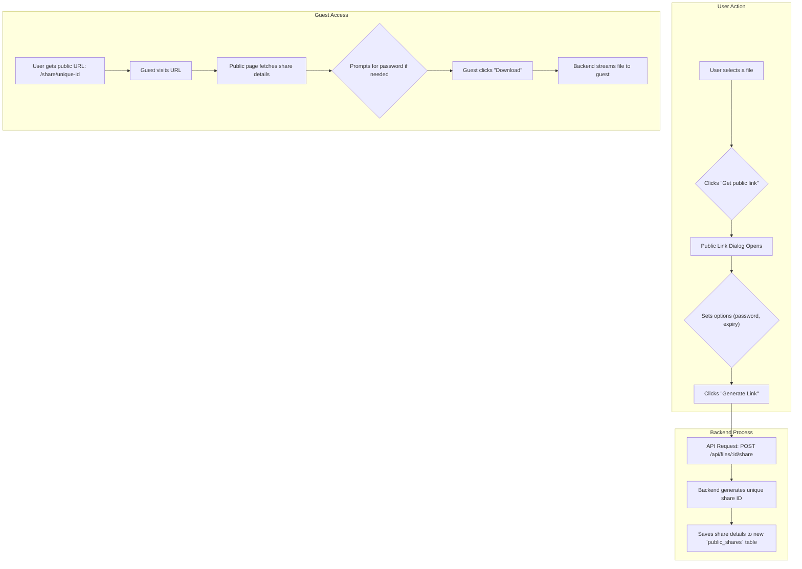

# Plan: Public Shareable Links

This feature will enable users to generate a unique URL for a file that can be shared publicly, with optional security features like password protection and expiration dates.

## Workflow

## Proposed Task Breakdown

-   [ ] **Database:** Add a `public_shares` table to the schema to store share links, passwords, and expiration dates.
-   [ ] **Backend:** Create an API endpoint to generate and manage public links.
-   [ ] **Backend:** Create a public, unauthenticated endpoint for downloading shared files.
-   [ ] **Frontend:** Design and build a "Get Public Link" dialog component.
-   [ ] **Frontend:** Create a new public-facing page (`/share/[shareId]`) to display the shared file information and download button.