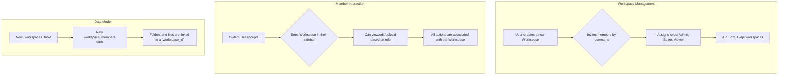

# Plan: Team Workspaces

This feature introduces the concept of "Workspaces," which are shared environments where multiple users can be invited to collaborate on files and folders. This moves Stashcord from a personal storage application to a collaborative platform.

## Workflow

## Proposed Task Breakdown

-   [ ] **Database:** Add `workspaces` and `workspace_members` tables. Modify `folders` and `files` to include a `workspace_id`.
-   [ ] **Backend:** Create API endpoints for creating, managing, and inviting users to workspaces.
-   [ ] **Backend:** Update all existing file/folder endpoints to be workspace-aware and respect member roles.
-   [ ] **Frontend:** Add a workspace switcher to the UI.
-   [ ] **Frontend:** Create a settings page for workspace management (inviting members, changing roles).
-   [ ] **Frontend:** Ensure all file and folder operations happen within the context of the selected workspace.