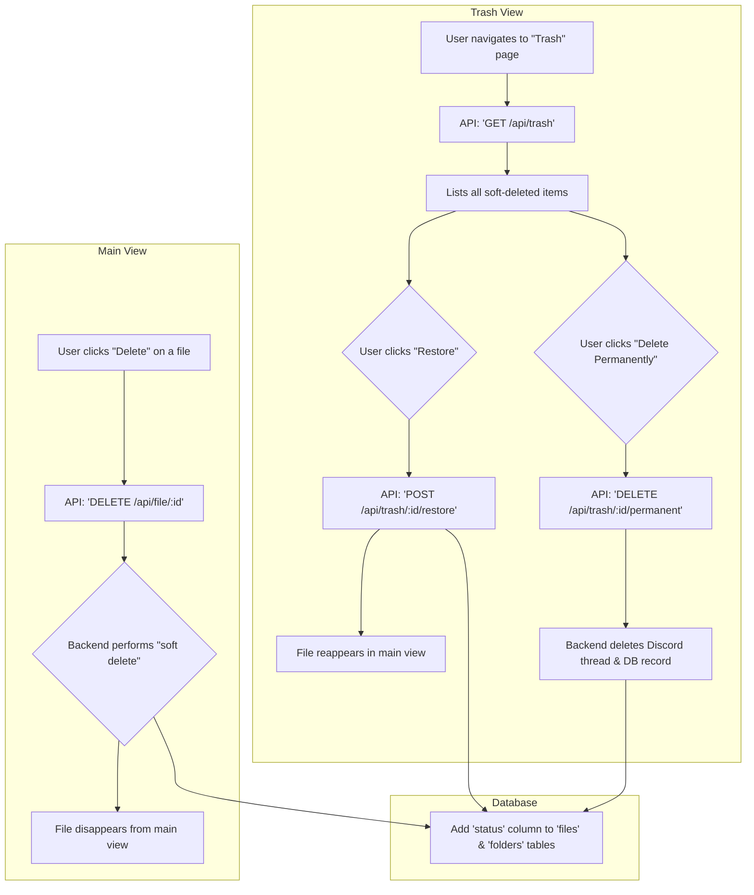

# Plan: Trash & Recovery System

This feature introduces a "Trash" or "Recycle Bin" to prevent accidental data loss. When a user deletes a file or folder, it is first "soft-deleted" and can be recovered or permanently deleted later.

## Workflow

## Proposed Task Breakdown

-   [ ] **Database:** Add a `status` column (e.g., 'active', 'trashed') to the `files` and `folders` tables.
-   [ ] **Backend:** Modify the existing `DELETE` endpoints to perform a soft delete (i.e., update the status to 'trashed').
-   [ ] **Backend:** Create a new endpoint (`GET /api/trash`) to fetch all items marked as 'trashed'.
-   [ ] **Backend:** Create a new endpoint (`POST /api/trash/:id/restore`) to restore an item.
-   [ ] **Backend:** Create a new endpoint (`DELETE /api/trash/:id/permanent`) for permanent deletion.
-   [ ] **Frontend:** Create a new "Trash" page accessible from the main layout.
-   [ ] **Frontend:** Implement "Restore" and "Delete Permanently" actions in the Trash view.